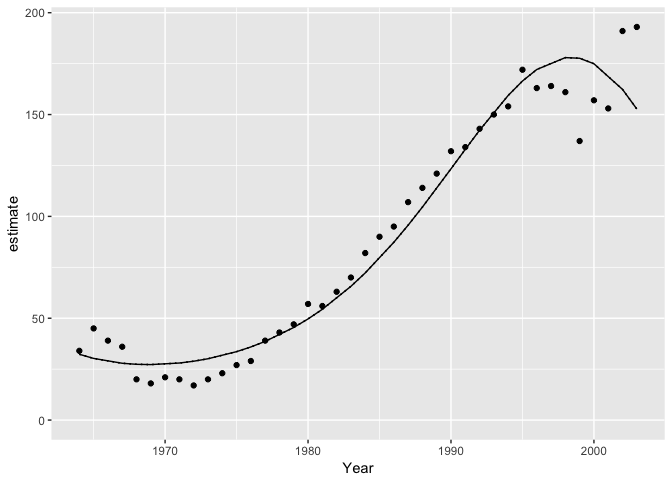

<!-- README.md is generated from README.Rmd. Please edit that file -->
[](https://travis-ci.org/poissonconsulting/tmbr) [](https://ci.appveyor.com/project/poissonconsulting/tmbr) [](https://codecov.io/gh/poissonconsulting/tmbr)

tmbr
====

Introduction
------------

`tmbr` (pronounced timber) is an R package to facilitate analyses using Template Model Builder (TMB).

Demonstration
-------------

``` r
library(ggplot2)
library(tmbr)
#> Loading required package: mbr
#> Loading required package: broom
#> Loading required package: mcmcr
#> 
#> Attaching package: 'mcmcr'
#> The following object is masked from 'package:ggplot2':
#> 
#>     derive
#> Loading required package: newdata

options("mb.parallel" = TRUE)
doParallel::registerDoParallel(4)

data <- bauw::peregrine

template <- "
#include <TMB.hpp>

template<class Type>
Type objective_function<Type>::operator() () {

DATA_VECTOR(Pairs);
DATA_VECTOR(Year);

PARAMETER(alpha);
PARAMETER(beta1);
PARAMETER(beta2);
PARAMETER(beta3);

vector<Type> ePairs = Pairs;

Type nll = 0.0;

for(int i = 0; i < Pairs.size(); i++){
  ePairs(i) = exp(alpha + beta1 * Year(i) + beta2 * pow(Year(i), 2) + beta3 * pow(Year(i), 3));
  nll -= dpois(Pairs(i), ePairs(i), true);
}
return nll;
}"

new_expr <- "
for (i in 1:length(Pairs)) {
  prediction[i] <- exp(alpha + beta1 * Year[i] + beta2 * Year[i]^2 + beta3 * Year[i]^3)
}"

gen_inits <- function(data) list(alpha = 4, beta1 = 1, beta2 = 0, beta3 = 0)

model <- model(template, scale = "Year", gen_inits = gen_inits, new_expr = new_expr)

analysis <- analyse(model, data = data)
#> Note: Using Makevars in /Users/joe/.R/Makevars

glance(analysis)
#> # A tibble: 1 × 6
#>       n     K    logLik     AICc minutes converged
#>   <int> <int>     <dbl>    <dbl>   <int>     <lgl>
#> 1    40     4 -159.1842 327.5113       0        NA
tidy(analysis)
#> # A tibble: 4 × 5
#>    term     estimate  std.error  statistic       p.value
#>   <chr>        <dbl>      <dbl>      <dbl>         <dbl>
#> 1 alpha  4.232280328 0.03004250 140.876456  0.000000e+00
#> 2 beta1  1.116410020 0.04777944  23.365909 9.497676e-121
#> 3 beta2  0.007065185 0.02408137   0.293388  7.692256e-01
#> 4 beta3 -0.233904157 0.02513417  -9.306221  1.324617e-20

year <- predict(analysis, new_data = new_data(data, "Year"))

ggplot(data = year, aes(x = Year, y = estimate)) +
  geom_point(data = data, aes(y = Pairs)) +
  geom_line() +
  expand_limits(y = 0)
```



``` r

# analysis <- reanalyse(analysis)
# 
# plot(analysis)
# 
# glance(analysis)
# tidy(analysis)
```

Installation
------------

To install from GitHub

    # install.packages("devtools")
    devtools::install_github("poissonconsulting/tmbr")

Contribution
------------

Please report any [issues](https://github.com/poissonconsulting/tmbr/issues).

[Pull requests](https://github.com/poissonconsulting/tmbr/pulls) are always welcome.

Please note that this project is released with a [Contributor Code of Conduct](CONDUCT.md). By participating in this project you agree to abide by its terms.

Inspiration
-----------

-   [jaggernaut](https://github.com/poissonconsulting/jaggernaut)

Documentation
-------------

-   [TMB](https://github.com/kaskr/adcomp)
