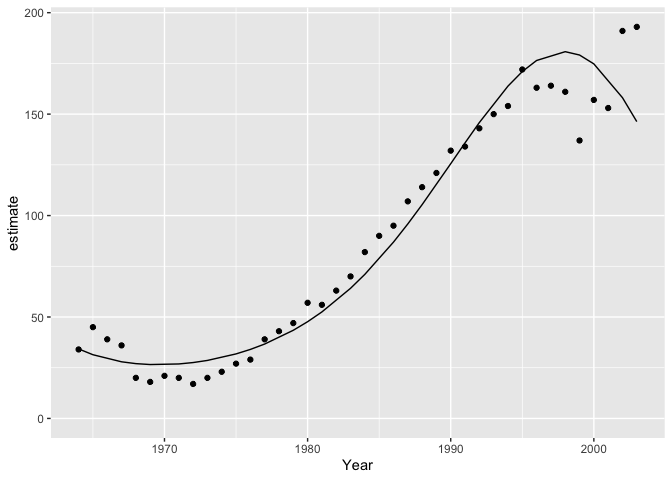

<!-- README.md is generated from README.Rmd. Please edit that file -->


 [](https://www.tidyverse.org/lifecycle/#maturing)
 [](https://travis-ci.org/poissonconsulting/tmbr)
[](https://ci.appveyor.com/project/poissonconsulting/tmbr)
[](https://codecov.io/gh/poissonconsulting/smbr)
[](https://opensource.org/licenses/MIT)
[](https://doi.org/10.5281/zenodo.1162374)

# tmbr

## Introduction

`tmbr` (pronounced timber) is an R package to facilitate analyses using Template Model Builder ([`TMB`](https://github.com/kaskr/adcomp)).
It is part of the [mbr](https://github.com/poissonconsulting/mbr) family of packages.

## Installation

Installation of TMB on Windows is currently proving [challenging](https://github.com/James-Thorson/2016_Spatio-temporal_models/issues/7).
Until these issues are resolved `tmbr` is only supported on unix-based OSs.

To install from GitHub
```
# install.packages("devtools")
devtools::install_github("poissonconsulting/tmbr")
```

## Demonstration


```r
library(magrittr)
library(ggplot2)
library(tmbr)
```


```r
model <- model("#include <TMB.hpp>

template<class Type>
Type objective_function<Type>::operator() () {

DATA_VECTOR(Pairs);
DATA_VECTOR(Year);
DATA_FACTOR(Annual);
DATA_INTEGER(nAnnual);

PARAMETER(alpha);
PARAMETER(beta1);
PARAMETER(beta2);
PARAMETER(beta3);
PARAMETER_VECTOR(bAnnual);
PARAMETER(log_sAnnual);

Type sAnnual = exp(log_sAnnual);

vector<Type> ePairs = Pairs;

Type nll = 0.0;

for(int i = 0; i < nAnnual; i++){
  nll -= dnorm(bAnnual(i), Type(0), sAnnual, true);
}

for(int i = 0; i < Pairs.size(); i++){
  ePairs(i) = exp(alpha + beta1 * Year(i) + beta2 * pow(Year(i), 2) + beta3 * pow(Year(i), 3) + bAnnual(Annual(i)));
  nll -= dpois(Pairs(i), ePairs(i), true);
}
ADREPORT(sAnnual)
return nll;
}")

# add R code to calculate derived parameters
model %<>% update_model(new_expr = "
for (i in 1:length(Pairs)) {
  log(prediction[i]) <- alpha + beta1 * Year[i] + beta2 * Year[i]^2 + beta3 * Year[i]^3 + bAnnual[Annual[i]]
}")

# define data types and center year
model %<>% update_model(
  gen_inits = function(data) list(alpha = 4, beta1 = 1, beta2 = 0, beta3 = 0, log_sAnnual = 0, bAnnual = rep(0, data$nAnnual)),
  select_data = list("Pairs" = integer(), "Year*" = integer(), Annual = factor()),
  random_effects = list(bAnnual = "Annual"))

data <- bauw::peregrine
data$Annual <- factor(data$Year)

analysis <- analyse(model, data = data)
#> # A tibble: 1 x 5
#>       n     K logLik    IC converged
#>   <int> <int>  <dbl> <dbl> <lgl>    
#> 1    40     5  -154.  321. TRUE     
#> Warning: 4 external pointers will be removed

coef(analysis)
#> # A tibble: 5 x 7
#>   term        estimate     sd   zscore   lower   upper   pvalue
#>   <S3: term>     <dbl>  <dbl>    <dbl>   <dbl>   <dbl>    <dbl>
#> 1 alpha         4.26   0.0379  112.     4.19    4.34   0.      
#> 2 beta1         1.19   0.0697   17.1    1.05    1.33   2.10e-65
#> 3 beta2        -0.0177 0.0289   -0.611 -0.0743  0.0390 5.41e- 1
#> 4 beta3        -0.272  0.0357   -7.62  -0.342  -0.202  2.63e-14
#> 5 log_sAnnual  -2.31   0.271    -8.53  -2.84   -1.78   1.45e-17
```


```r
year <- predict(analysis, new_data = "Year")

ggplot(data = year, aes(x = Year, y = estimate)) +
  geom_point(data = bauw::peregrine, aes(y = Pairs)) +
  geom_line() +
  expand_limits(y = 0)
```



## Citation


```

To cite tmbr in publications use:

  Joe Thorley (2018) tmbr: Analyses Using TMB. doi:
  https://doi.org/10.5281/zenodo.1162374.

A BibTeX entry for LaTeX users is

  @Misc{,
    author = {Joe Thorley},
    year = {2018},
    title = {tmbr: Analyses Using TMB},
    doi = {https://doi.org/10.5281/zenodo.1162374},
  }

Please also cite TMB.
```

## Contribution

Please report any [issues](https://github.com/poissonconsulting/tmbr/issues).

[Pull requests](https://github.com/poissonconsulting/tmbr/pulls) are always welcome.

Please note that this project is released with a [Contributor Code of Conduct](CONDUCT.md). By participating in this project you agree to abide by its terms.
